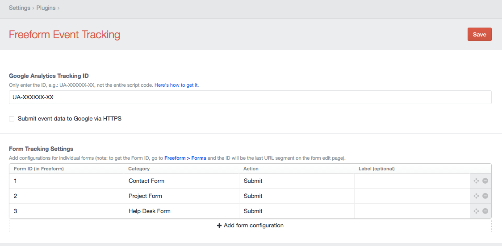

# Freeform Event Tracking plugin for Craft CMS

Implement Google event tracking for Freeform form submissions

## Installation

To install Freeform Event Tracking, follow these steps:

1. Download & unzip the file and place the `freeformeventtracking` directory into your `craft/plugins` directory
2.  -OR- do a `git clone https://github.com/sparkison/freeformeventtracking.git` directly into your `craft/plugins` folder.  You can then update it with `git pull`
3.  -OR- install with Composer via `composer require sparkison/freeformeventtracking`
4. Install plugin in the Craft Control Panel under Settings > Plugins
5. The plugin folder should be named `freeformeventtracking` for Craft to see it.  GitHub recently started appending `-master` (the branch name) to the name of the folder for zip file downloads.

Freeform Event Tracking works on Craft 2.4.x and Craft 2.5.x.

## Freeform Event Tracking Overview

Allows for sending custom events to Google upon successful form submission. Will not send subsequent event if form is being updated.
Includes ability to only send events for specific forms by form id.

## Configuring Freeform Event Tracking

Navigate to  **Settings > Freeform Event Tracking** to configure.

## Using Freeform Event Tracking

Once configured, you should be good to go! Events will now be sent to Google upon successfuly form submission.

## Freeform Event Tracking Roadmap

Currently the event response is logged to the database. Will be adding an additional tab to review the log at some point...

* Release it

Brought to you by [https://nerdymind.com/](https://nerdymind.com/)
